# 제11회 산업통상자원부  공공데이터활용 BI공모전 빅데이터 분석 과제 4

## 23. 6. 26. ~ 23. 7. 10. 기상변수와 시계열 분석을 활용한 전력 수요 예측

> ## 전략 및 아이디어
>
> 
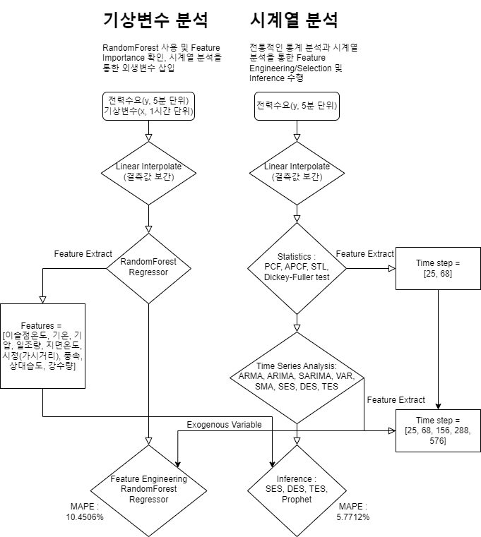

> 
> github : https://github.com/Jonghyun-Park1027/Competition1
> ### 1. 온도와 전력수요의 상관관계
> - 산업 소요량은 비교적 고정적이나 온도에 따른 일반 가정, 도심지 등의 전력 수요량이 달라질 수 있다.
> ### 2. 예측의 불확실성
> - 완벽히 미래를 예측할 수 없지만, 특정 Feature가 주요한 변수가 될 수 있다.
> - 시계열 분석 및 통계적 검정을 통한 주요 Feature 선별
> ### 3. 온열 4요소
> - 인간의 건강을 해치는 요소는 에어컨, 난방기 사용 등 여러가지 환경비용 및 전력수요를 발생시킴.
> ### 4. Feature Engineering
> - 각 분석을 토대로 새로운 변수를 생성하여 적용하고, 더 나은 예측력을 도출한다.
> ### 5. 5분 단위 전력수급 데이터
> - ‘현재수요(MW)’를 y value로 지정, 그 외 변수들은 후행성 지표로 우선 제외 처리
> ### 6. 기상청 예보 및 실적(API)
> - 고도에 따른 이상치 처리, 레퍼런스를 활용한 인간 건강과 관계된 요소를 Feature로 추출
> ## 분석 모델
> ### 1. 개요
> - 학습 기간 2022-04-01 00:00:00 ~ 2023-03-12 23:55:00 
> - 추론 기간 2023-03-13 00:00:00 ~ 2023-03-19 23:55:00(일주일)
> - Y value는 5분 단위 전력수급의 ‘현재수요(MW)’를 사용함
> - 기상변수는 기상청 API를 활용했으며, 노정(온도 측정기구)의 고도에 따른 이상치를 IQR을 통해 제거하여 총 94개의 기상 관측소의 1시간 단위 데이터를 사용함 
> ### 2. 분석 과정
> 
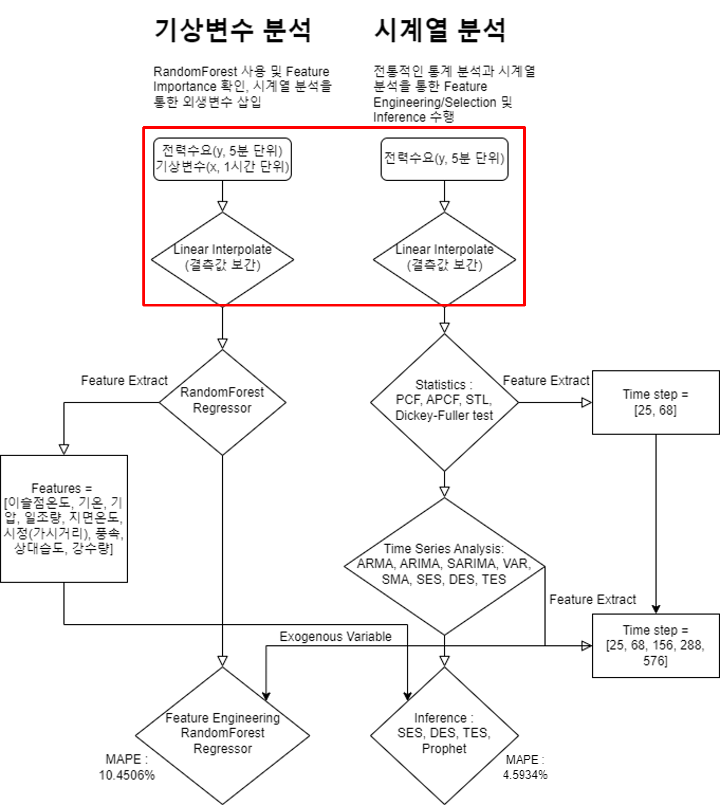

>
> - Y value에도 결측값이 존재하여 Linear Interpolate를 통해 보간
> - train : 99545개 -> 99648개, 103개 증가
> - test : 2016개 -> 2016개, 변화없음
> - 기상변수로 활용한 X value는 1시간 단위 데이터만 제공하므로, Linear Interpolate를 통해 5분 단위 데이터 변환 및 보간
> - data : 8473 -> 101664    
> 
>
> 
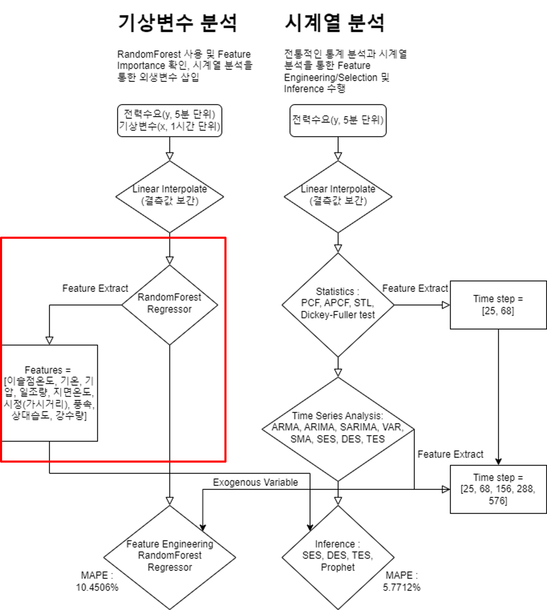

>
> - 기상변수 모델은 현재수요(y)와 concat하여 vanilla RandomForest로 학습시킴. 이에 test에 대한 mape는 10.45%~10.74% 수준이며 9개의 Feature를 추출함.    
>
> 
> 
> 
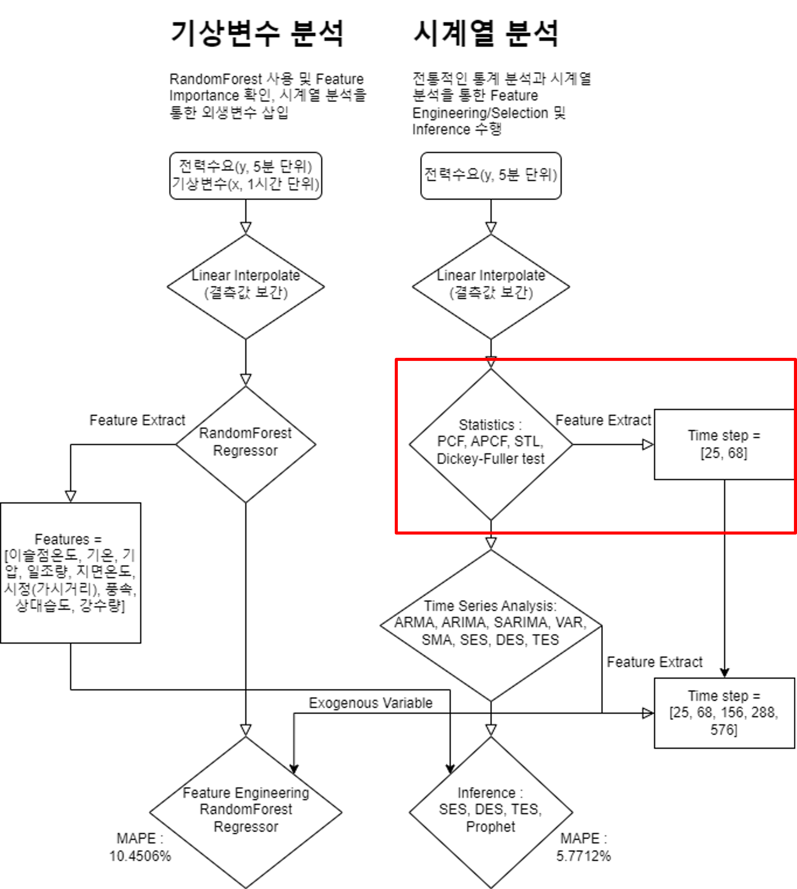

>
>- 기본적 통계 모델을 통한 시계열 분석을 수행, Dickey-Fuller test를 통해 장기/중기/단기간 데이터의 정상성을 확인
> - PCF, APCF, STL 분해로 데이터의 Trend, Seasonality, 잔차 등을 확인  
> - 각 분석을 통해 차분요소(I = 2)와 자기 상관성, 유효한 Time step을 확인함(25, 68)    
> 
> 
> 
> 
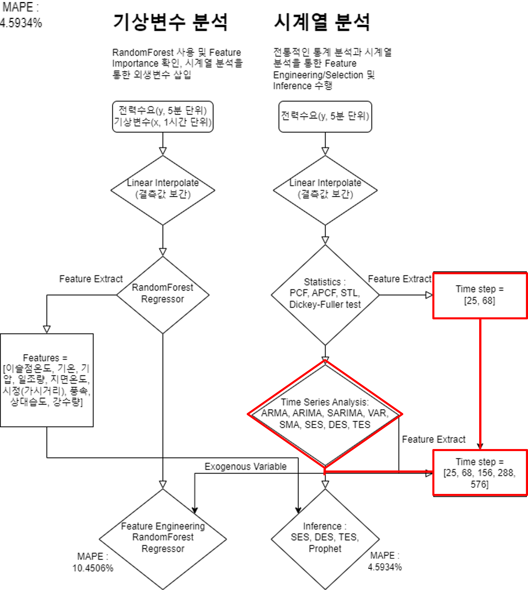

>
> - 통계 분석을 바탕으로 차분, 다항식 및 이동평균을 고려한 ARMA, ARIMA / 이중, 삼중 지수 평활화로 데이터를 분석함.
> - Seasonality가 고려된 삼중 지수 평활화에 의해 156, 288, 576의 추가적인 Time Step을 추출했으며, 이는 각각 13시간, 24시간, 48시간에 해당하는 숫자임
> - Vector AutoRegression(VAR)은 과대학습 및 선형 추론의 한계로 Drop
> - 계절 변수를 고려한 SARIMAX를 수행했으나 컴퓨팅 자원의 한계로 분석 불가
> - ARMA, ARIMA는 긴 연산시간과 낮은 정확성을 보였으며, 이는 변수의 차원대비 낮은 AR(다차항)에 의해 변별력이 떨어진다고 판단됨. 또한 그에 따른 컴퓨팅 자원 역시 부족했음.    
> 
> 
> 
> 
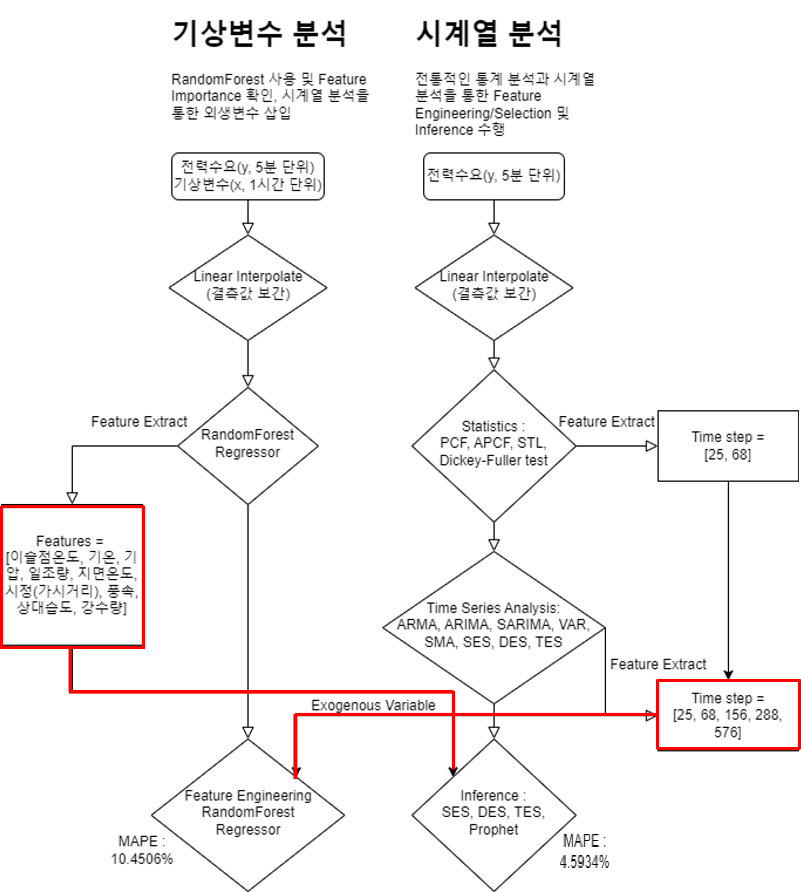

>
> - 기상 변수를 분석한 RandomForest 모델에 유효한 Time Step과 삼중 지수 평활화를 활용하여 기상 변수의 파생 변수를 생성
> - 추론 결과 가장 성능이 좋은 Prophet 모델에 기상 변수를 외생 변수로 삽입    
> 
> 
> 
> 
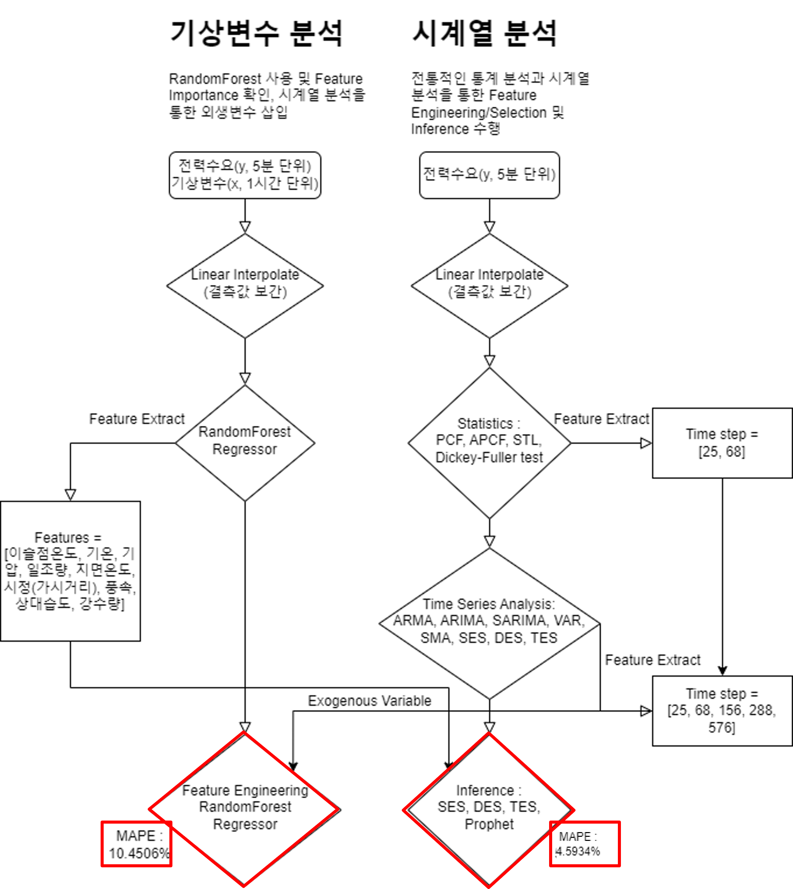

>
> - RandomForest 모델은 RFECV 및 Feature Selection등을 통해 실험했으나 과적합 및 삼중 지수 평활화 Addtive모델에 의한 오류의 증가  등으로 더 나은 성능을 보이지 못함.
> - 외생변수 및 퓨리에 변환, Seasonality에 변화를 주었으나 모델 성능에 영향을 주지 않음.
> ## 분석 결과
> ### 1. DES, TES
> 
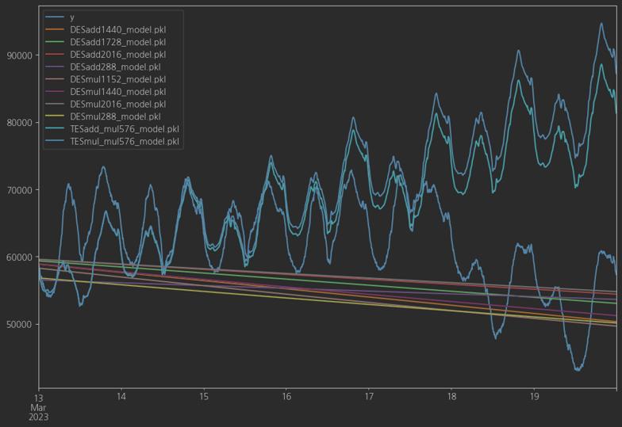

>
> 
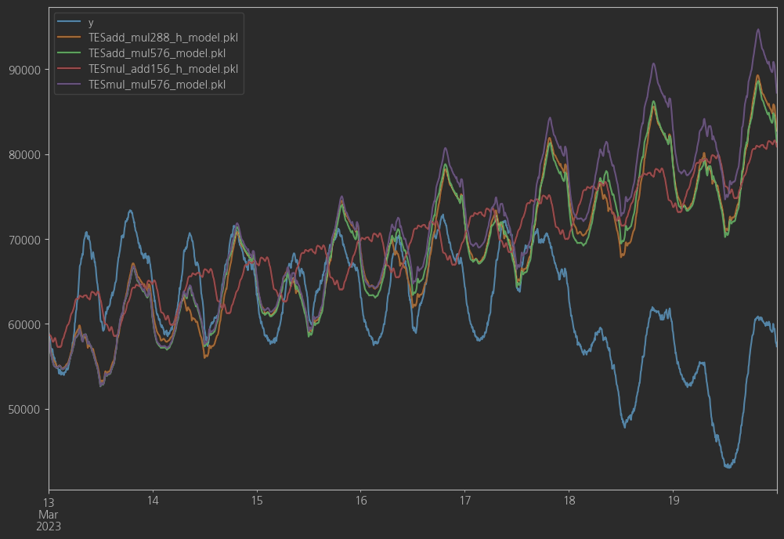

>
> - DES(Trend)_(Seasonal)(Time Step) : Trend(additive, multiplicative) / Seasonal(additive, multiplicative)
> - 최대 mape : 16.5317% 
> 
> 
> 
> ### 2. ARMA, ARIMA
> 
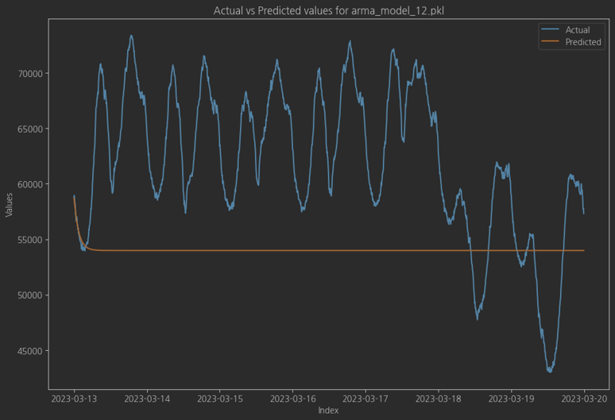

>
> - Time step에 따른 차이 없음(최대 mape 14.1278% 및 Underfitting)
> 
> ### 3. Prophet
> 
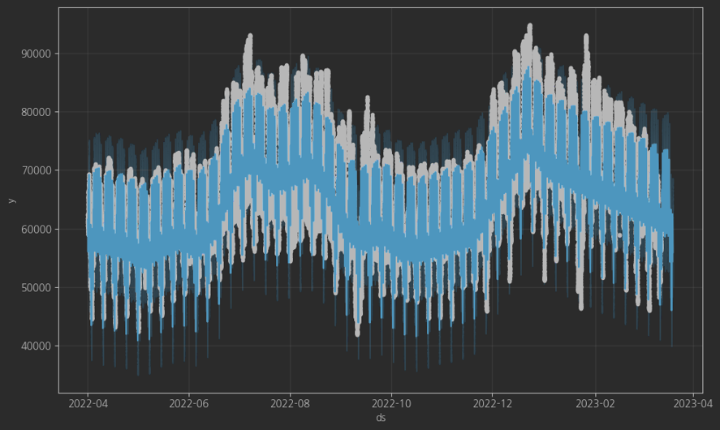

>
> 
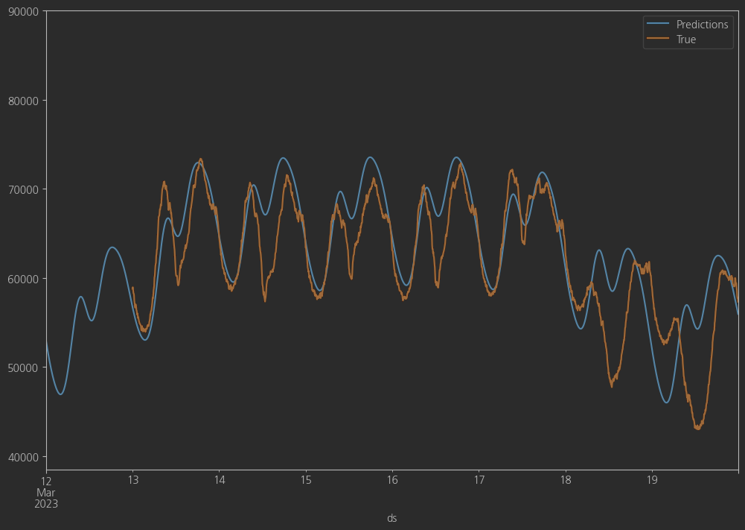

>
> - 이슬점온도, 기온, 상대습도, 강수량, 일조량, 지면온도, 풍속, 기압, 시정(가시거리)를 외생변수로 삽입한 결과
MAPE는 1.1778상승해 4.5934를 달성할 수 있었음.
> 
> 
> 
> ### 4-1. 기상변수 Vanilla RandomForest
> 
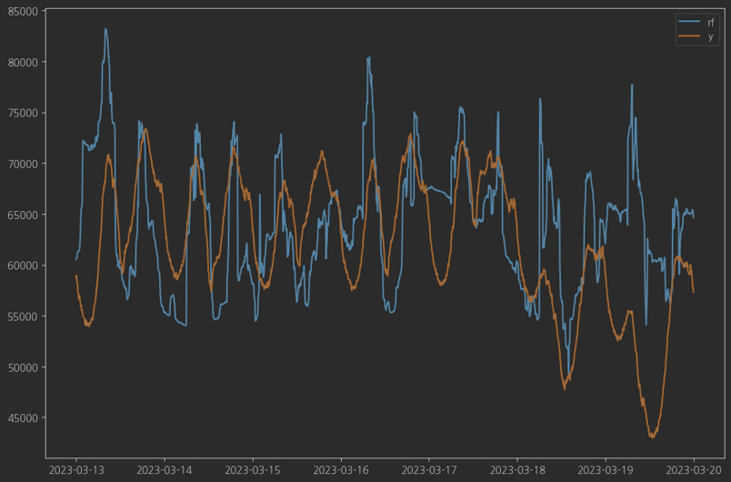

>
> 
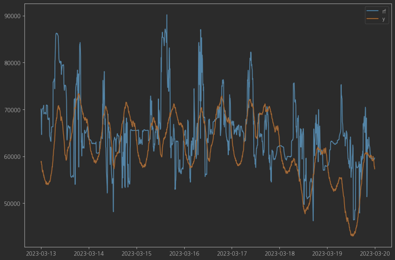

>
> - TES 파생변수(Time Step) 적용시 과대적합 또는 오류 증폭(최대 mape 10.4506%)
> 
> 
> 
> ### 4-2 기상변수 Feature Importances
> 
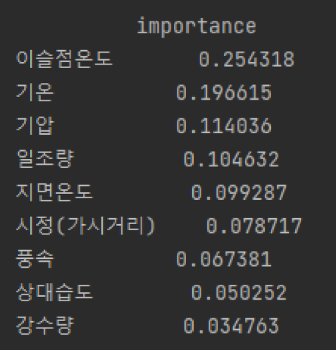

## 결론 및 제언
### 1. 기상청 데이터와 전력수요의 상관관계 입증
- Hyperparameter Tunning 없이 전처리(고도, 국내 전 지역 측정치 평균) 된 기상청 데이터로 평가된 테스트 데이터는 mape 10.4506%로 유효한 결과를 나타냄. 
- 그러나 파생변수를 만드는 과정에서 0값의 존재로, 결국 반영된 파생 변수는 각 유효 시점별 Triple Exponential Smoothing의 Trend/Seasonal Additive 모델 뿐이었음. 이는 본 분석의 한계점이나 기상청 데이터의 추가 활용 가능성을 확인했음.
### 2.  분석 방법론의 세분화 필요성
- 선형 보간법, 차분, 자기상관 분석 등 다양한 툴을 사용하였으나, Time Series 보간법, 변수간 ANOVA 분석 등 모든 분석 방법을 고려하지 않았음. 따라서 세분화 및 교차분석을 통해 분석의 정확성을 높일 필요가 있음.
### 3.  시계열 분석의 고도화 가능성
- ARMA, ARIMA, SARIMAX는 그 우수성에도 불구하고 연구자 및 컴퓨팅 자원의 한계로 깊은 분석을 수행할 수 없었음. 이 또한 향후 시계열 데이터 분석의 추가 가능성을 제시함. 분석 결과 전력 수요 데이터는 Seasonality가 매우 중요했으며, 이를 분석하기 위해 더욱 많은 컴퓨팅 자원과 시간을 통해 시계열 분석 모델을 고도화 할 필요가 있음.
- 5분 단위 데이터인 ‘현재수요(MW)’에서 공통적으로 관찰된 주요 시점은 25, 68, 156, 288, 576으로 시간으로 환산하면 2.08, 5.67, 13, 24, 48시간임. 본 분석에서 수행되지 못한 모델과 유효 시점을 활용한다면 더욱 좋은 예측 모델 구현이 가능함.
### 4.  예측 모델의 고도화 가능성
- 본 분석은 전통적인 시계열, 통계 모델에 근거하여 더 나은 모델링 도입의 가능성을 제시함. 본 분석에서 제시한 근거를 바탕으로 TFT, Multi-step Time Series, Deep Learning 모델 등을 통해 더 나은 예측 모델 개발이 가능함.
### 5. 외생변수에 따른 성능 향상
- 이슬점온도, 기온, 상대습도, 강수량, 일조량, 지면온도, 풍속, 기압, 시정(가시거리)를 외생변수로 삽입한 결과
MAPE는 1.1778상승해 4.5934를 달성할 수 있었음.
